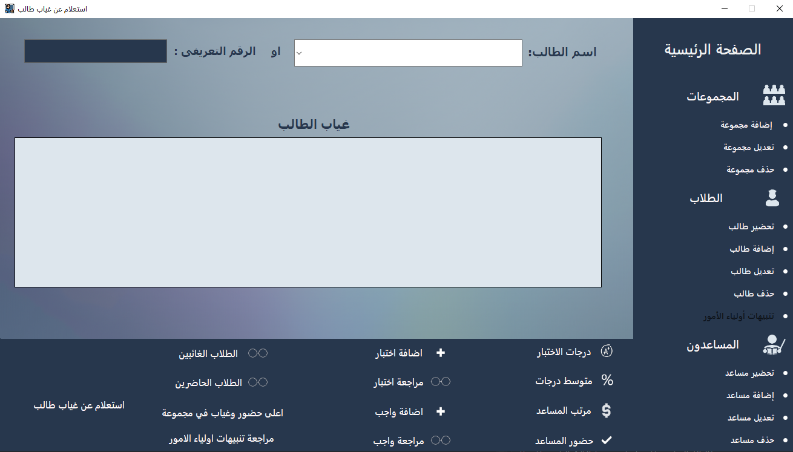

# Student Management System

## Overview

## Version

Current Version: 2.1.0

Welcome to the Student Management System repository! This project is designed to facilitate student management for teachers of various subjects, including Arabic, Mathematics, English, Physics, Chemistry, Philosophy, and more. The system provides a centralized database for storing and efficiently managing student information.

## Video Demo

Check out the [video demonstration](https://fb.watch/pw5mw2PvmU/) to see the features of the Student Management System.

## Features

- **Student Database:** Centralized storage for student information, including full name, student ID, contact details, date of birth, and academic level.
- **Attendance Tracking:** Easily record and manage daily student attendance with barcode support.
- **Academic Records Management:** Record and calculate grades for assignments, daily tests, monthly exams, and comprehensive exams.
- **Communication Platform:** Stay connected with parents through automatic WhatsApp communication.
- **User-Friendly Interface:** Intuitive and easy-to-use interface for teachers with varying levels of technical proficiency.

## Usage

1. Register students, groups, and assistants.
2. Record attendance using barcodes.
3. Customize ID card designs for each teacher.
4. Print student ID cards or save them in PNG format.
5. Monitor parent alerts for student absence via WhatsApp.
6. Send exam grades to parents via WhatsApp.
7. Monitor parent alerts for incomplete assignments via WhatsApp.
8. View student rankings in class and exams.
9. Multiple user roles with different permissions (teacher, assistant).
10. Identify top attendance and top absentee groups.
11. Review alerts within a specified period.
12. Track assistant schedules and attended sessions.
13. Review success rates of students in a specific group.
14. View average student grades in a specific test on a particular day or within a specific period.

## Developers - ArtOfCoding

The Student Management System was developed by the talented team at ArtOfCoding. With a passion for creating innovative solutions, ArtOfCoding has successfully designed and implemented this system to meet the needs of teachers and educators.

## How to Buy

If you are interested in purchasing the Student Management System, please contact us:

- WhatsApp/Call: 01093307397
- WhatsApp/Call: 01288513225
- WhatsApp: 01032443829
- Email: sayed.work223@gmail.com

We appreciate your interest and support!
